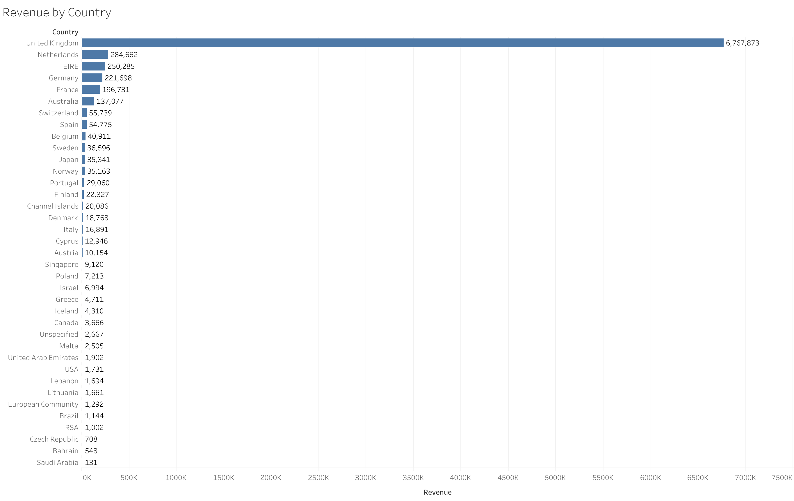
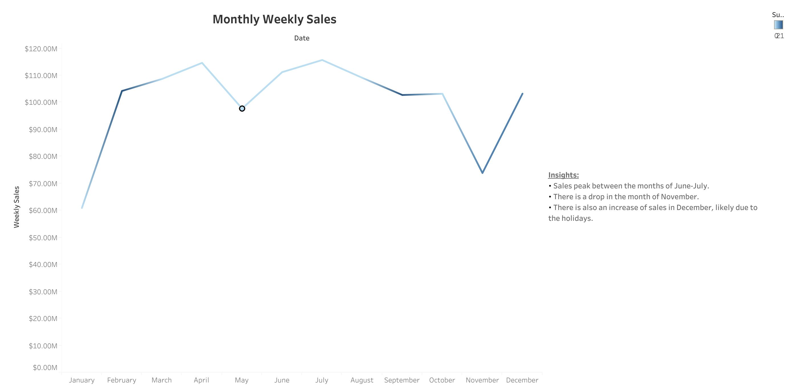
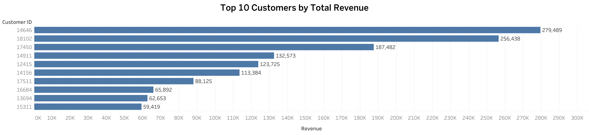

# Online-retail-sales-analysis

## Project Overview
This project analyzes online retail transaction data using SQL and Tableau.  
The goal was to clean the dataset, identify customer purchasing patterns, and create visualizations to highlight revenue trends and customer behavior.

## Tools Used
- SQL (SQLite)
- Tableau Public
- GitHub

## Key Business Questions
- Which countries generate the most revenue?
- Who are the top 10 customers by revenue?
- How does monthly revenue change over time?

## Key Insights
- The United Kingdom generated the highest revenue, exceeding $6.7 million.
- The highest spending customer generated approximately $279K in revenue.
- Revenue increased significantly in late 2011 before declining in December.

## Project Files
- SQL_queries.sql
- Tableau Visualizations
- Dataset / Cleaned Data

## Visualizations

### Revenue by Country

### Monthly Revenue Trend

### Top 10 Customers by Revenue

